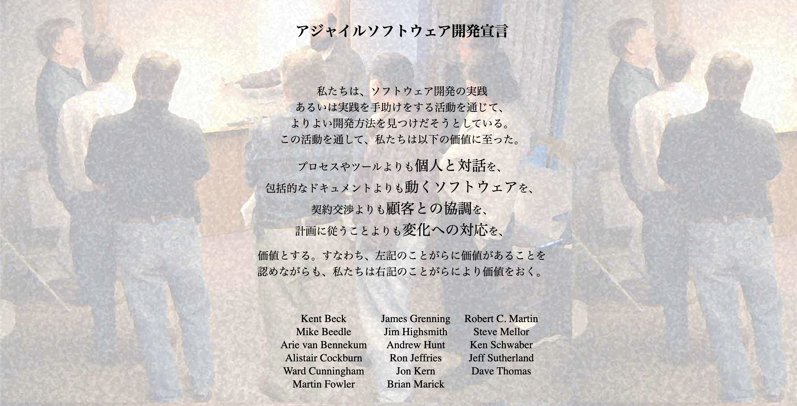
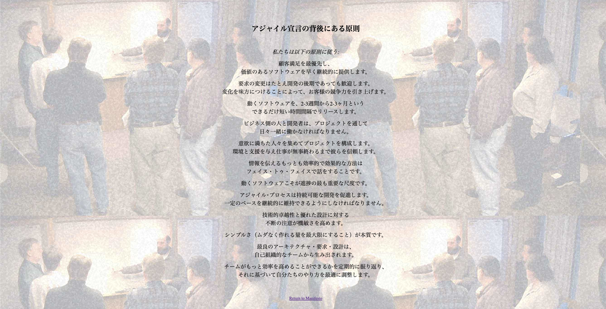
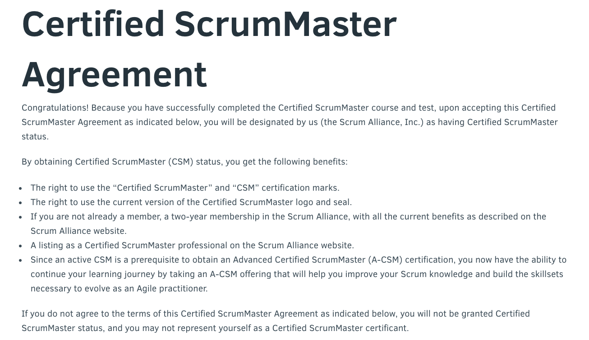

# Certified ScrumMaster
## 準備

このセルフアセスメントで、私が記載した参考文献やチュートリアルと全く関係のない回答をされる方が多くいらっしゃいます。この練習では、参加者のみなさんが考えるスクラムは、Ken Schwaberや他のアジャイルソフトウェア開発宣言の著者が表明している内容と異なる可能性がおおいにあることを念頭においてください。今一度、ご自身が見てきたスクラムではなく参考文献やチュートリアルをご覧になった上で、質問にご回答ください。 ネットにはアジャイルやスクラムに関して多くの間違った情報があふれています。間違った情報に出会うたびに訂正していこうとすると、かなりのトレーニング時間が潰れてしまいます。
そのため、参照元は

  - [アジャイルマニフェスト4つの価値](http://agilemanifesto.org/iso/ja/manifesto.html)
  - [アジャイルマニフェスト12の原則](http://agilemanifesto.org/iso/ja/principles.html)
  - [リファレンスカード](http://scrumreferencecard.com/ScrumReferenceCard-jp.pdf)
  - [スクラムガイド](https://www.scrumguides.org/docs/scrumguide/v2017/2017-Scrum-Guide-Japanese.pdf)

の4つに限定したいと思います。

## 質問
トレーニング中に[LeSS](https://www.amazon.co.jp/%E5%A4%A7%E8%A6%8F%E6%A8%A1%E3%82%B9%E3%82%AF%E3%83%A9%E3%83%A0-Large-Scale-Scrum-LeSS-%E3%82%A2%E3%82%B8%E3%83%A3%E3%82%A4%E3%83%AB%E3%81%A8%E3%82%B9%E3%82%AF%E3%83%A9%E3%83%A0%E3%82%92%E5%A4%A7%E8%A6%8F%E6%A8%A1%E3%81%AB%E5%AE%9F%E8%A3%85%E3%81%99%E3%82%8B%E6%96%B9%E6%B3%95/dp/462130366X/ref=sr_1_1?s=digital-text&ie=UTF8&qid=1548655997&sr=8-1&keywords=LeSS+%E5%A4%A7%E8%A6%8F%E6%A8%A1%E3%82%B9%E3%82%AF%E3%83%A9%E3%83%A0)を参照しますが、現時点では必要ありません。もし、みなさんの回答がこれらの参照元以外で見つけられたものであれば、我々が採択する回答ではない可能性が高いです（例えばベロシティなど）。

  1. もしチームが、フィーチャーのコーディングを100%終えていて、80%テスト終えているとします。チームは何パーセント仕事が終わっていると言えるでしょうか？ヒント：全てスクラムが理想としている状態を答えてください。あなたの組織で実現可能かどうかを尋ねているわけではありません。フィーチャーは何％完成しているといえるでしょうか？（スクラムリファレンスカードを参照してみてください）
  2. スクラムではステークホルダーに対してどのように進捗を可視化できますか？最も良い方法を教えてください。(スクラムリファレンスカードかアジャイル宣言の背後にある原則を参照してみてください）
  3. フィーチャーチームとコンポーネントチームの違いをどのように判別できますか？どちらの方がアジャイル でしょうか？（スクラムリファレンスカードの「複数チーム」を参照してみてください）
  4. スクラムのフィードバックループが機能している状態が数ヶ月続いた場合、プロダクトバックログのアイテム増えるでしょうか？減るでしょうか？(スクラムリファレンスカードの「スクラム　イベント」を参照してみてください)
  5. あなた、もしくは周りの人たち従来の開発方法で経験した制約や制限事項は何かありますでしょうか？
  6. 従来のアプローチとアジャイル なアプローチで異なる点は何でしょうか？ (アジャイル ソフトウェア開発宣言、スクラムリファレンスカード又を参照してみてください)
  7. 「アジャイルアジャイル宣言の背後にある原則」のなかで共感できるものがあれば、３つあげてください。
  8. 「アジャイル ソフトウェア開発宣言」のなかで共感できるものがあれば、２つあげてくだささい。
  9. スクラムとは何でしょうか？(スクラムリファレンスカードを参照して頂いても良いですが、このような質問の回答としては、ただ、回答を写すのでは無く、あなたの解釈を答えて頂けると幸いです)
  10. スクラムのイベントそれぞれの目的をあなたの言葉で答えてください。＊イベントの目的なので、なぜスクラムにそのイベントが必要なのかを書いてください。イベントでやる事や構造は書かないでください。（スクラムリファレンスカードを参照してみてください)
  11. スクラムで定義されている役割のそれぞれの責任について、あなたの言葉で答えてください（スクラムリファレンスカードを参照してみてください)
  12. スクラムチームは最終的にどのように１スプリントでする仕事量を決めるのでしょうか？（スクラムリファレンスカードの「スクラム　イベント」を参照してみてください）
  13. スクラムの定義では、誰がチームを管理するのでしょうか？(スクラムリファレンスカードを参照してみてください)
  14. スクラムの定義では、最初のスプリントでチームは何に挑戦するべきなのでしょうか？ (スクラムリファレンスカードの「スクラムについて」を参照してみてください)
  15. ソフトウェアを構築する為にスクラムチームには具体的にどのようなスキルが必要でしょうか？(スクラムリファレンスカードを参照してみてください)
  16. おすすめされている典型的なスプリントの長さは？(スクラムリファレンスカードを参照してみてください)
  17. スクラムではスプリントの最長期間は定義されてますでしょうか (スクラムリファレンスカードを参照してみてください)
  18. スプリントはいつ終わりますか？ (スクラムリファレンスカードを参照してみてください)
  19. スクラムでテストに責任を持つのは誰ですか？ (スクラムレファレンスカードを参照してみてください)
  20. 厳格な見積もりはスクラムで重要視されていますでしょうか？ (スクラムリファレンスカードを参照してみてください)
  21. 進行中（WIP）の仕事は少ない方が好ましいことを考えると、どれくらいの期間で１つのプロダクトバックログアイテムを完成させられるのが好ましいと言えるでしょうか？  (スクラムリファレンスカードの「アーチファクト」を参照してみてください)
  22. どのイベントでプロダクトバックログのアイテム（PBI）はスプリントに持ち込まれるべきでしょうか？  (スクラムリファレンスカードを参照してみてください)
  23. 柔軟性を最大化する為に、どのイベントで最終的に個人が取るタスクを確定するのが好ましいでしょうか？
  24. スクラムやアジャイル に関して、質問、課題、疑問などはありますか?  ご自身でメモをしておいて頂き、トレーニング参加者用のSlackに登録がされましたら、Slackにてご質問ください。

## 参考資料
#### アジャイルマニフェスト4つの価値 (http://agilemanifesto.org/iso/ja/manifesto.html)
<table border="0">
<tr>
<td>
 © 2001, 上記の著者たち</td>
</tr>
</table>
 

#### アジャイルマニフェスト12の原則 (http://agilemanifesto.org/iso/ja/principles.html)
<table border="0">
<tr>
<td></td>
</tr>
</table>
 

## Certified ScrumMaster®
<table border="0">
<tr>
<td></td>
<td></td>
</tr>
</table>
 
