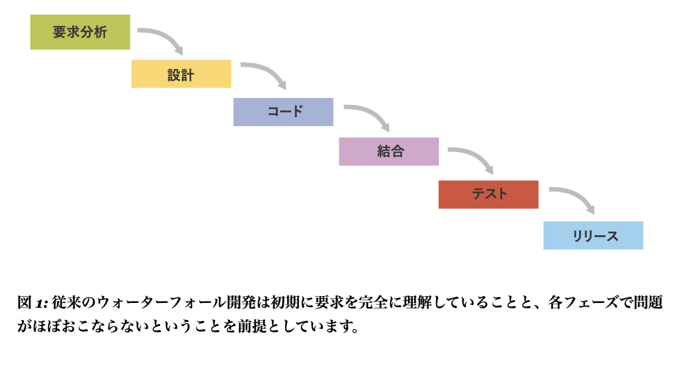
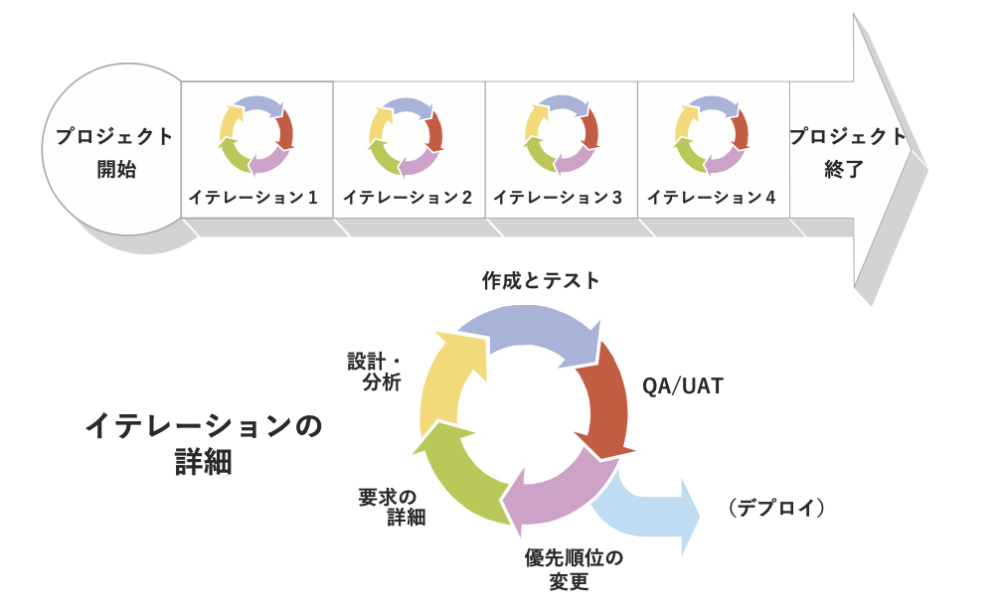
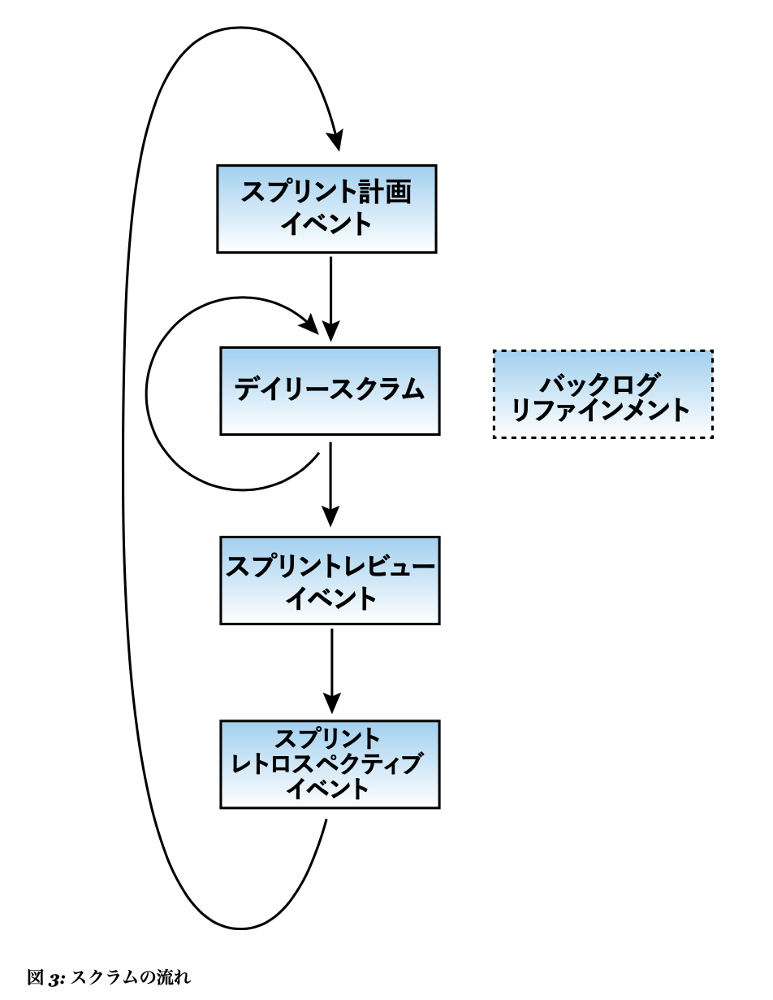
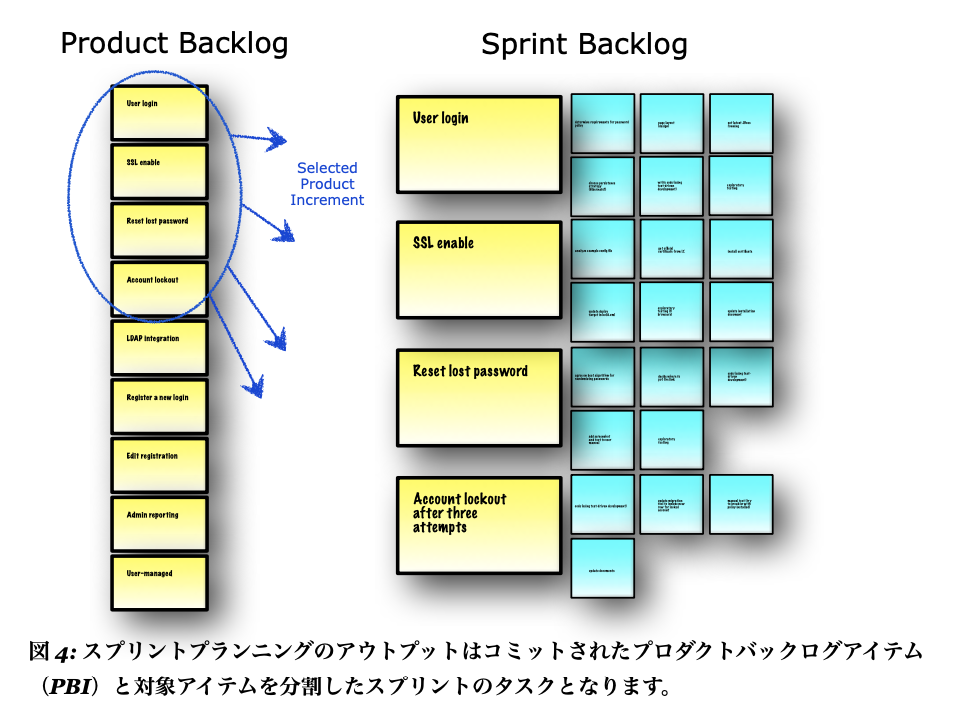
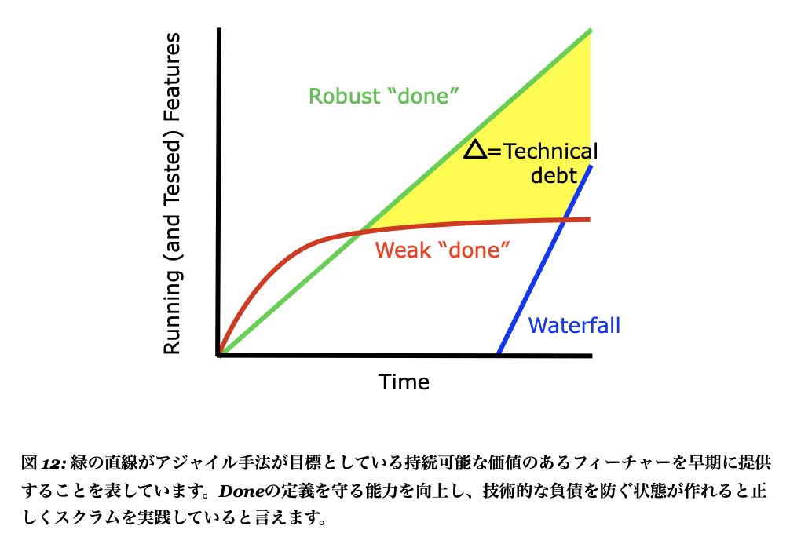

##### Certified ScrumMaster
# リファレンスカード
- by Michael James and Luke Walter
- http://scrumreferencecard.com/ScrumReferenceCard-jp.pdf

## INDEX
  - [スクラムについて](#スクラムについて)
  - [スクラムで定義されている役割](#スクラムで定義されている役割)
  - [スクラムイベント](#スクラムイベント)
  - [スクラムアーチファクト](#スクラムアーチファクト)
  - [複数チーム](#複数チーム)
  - [関連する手法](#関連する手法)
  - [自己組織化されたチーム](#自己組織化されたチーム)
  - [スクラムが適切な状況とは?](#スクラムが適切な状況とは?)

## [スクラムについて](#スクラムについて)
#### マネージメントフレームワーク
- スクラムは1チーム以上でプロダクト開発を行う為のフレームワークで、1つのチームは7名前後のクロスファンクショナルで自己組織化されたチームで構成されます。
- 役割、イベント、ルール、アーチファクトが提供され、チームはこのフレームワークの範囲内で自分達のプロセスを作り、適応していく責任があります。
- スクラムではスプリントという固定化された30日以下のイテレーション(より短い期間が推奨)単位に出荷可能(しっかりとテストされ た)なプロダクトインクリメントを作ることを求められます。

#### ウォーターフォールの代替
- スクラムはインクリメンタルでイテレーティブなアプローチで従来のフェイズ分けされたウォーターフォールでの開発とは異なり、価値の高いフィーチャーから実装し、早くフィードバックを得ることができます。
- スクラムのメリットを多く享受できるのはプロダクト開発のような複雑な知識創造と協働が必要な環境です。多くの場合はオブジェクト指向言語により実装されます。現在では半導体、住宅ローン、車椅子の開発にも使われるようになってきています。
- スクラムはあなたに容赦なくなく個人、チーム、組織の課題を突きつけてきます。多くの人は、課題を突きつけられた時にスクラム自体を変化させて対応してしまい、結果的にスクラムのメリットの多くを享受できない状態になってしまいます。
<table border="0">
<tr>
  <th bgcolor="#EE0000">ウォーターフォール</th>
  <th bgcolor="#EE0000">スクラム</th>
</tr>
<tr>
  <td></td>
  <td></td>
</tr>
</table>
 

## [スクラムで定義されている役割](#スクラムで定義されている役割)
#### スクラム開発チーム
  - クロスファンクショナル(例:テスト技術、ビジネスアナリスト、デザイナー、特定分野の専門家など通常は開発者とは呼ばれない人達も含まれます)
  - マネージャーが不要で自己組織・自己管理されている
  - 1スプリント単位でプロダクトオーナーとスプリントプランニングを行う
  - どのように実装するかの権限を有する
  - いつでも協働可能
  - 特に最初の数スプリントは1つの部屋に集まっていることが成功するために重要である
  - 長期固定でフルタイムが成功の重要な要素である。スクラムでは学習を促進する為にチームを長期間固定し、個人ではなくチームに仕事を与えます。人の移動やチームの分割をするのは避けてください
  - 6±3人
  - リーダーシップを発揮する

#### プロダクトオーナー
  - 開発にかけた投資効果(ROI)の最大化に責任をもつ。1名のみ
  - プロダクトのビジョンに責任を持つ
  - 常にプロダクトバックログの優先順位を入れ替え、リリース計画等を考慮し、調整する
  - 要求に関する意見が分かれた際などに最終的な決定権を持つ
  - リリース判断を行う
  - 開発継続の判断
  - ステークホルダー(関係者)の要望を考慮する
  - チームメンバーとして貢献することもある
  - リーダーシップを発揮する

#### スクラムマスター
  - スクラムを導入できる環境を組織に作っていく
  - スクラムが正しく理解されていることを担保し、導入を支援する
  - 自己組織チームが作れる環境を準備する
  - チームを外部の妨害から守り、フロー状態を維持する
  - 良いエンジニアリング技法の導入を支援する
  - チームに対してマネージメントの権限を持たない
  - 改善のサポートをする
  - リーダーシップを発揮する

## [スクラムイベント](#スクラムイベント)
<table border="0">
<tr>
  <th bgcolor="#EE0000">スクラムの流れ</th>
  <th bgcolor="#EE0000">バックログ</th>
</tr>
<tr>
  <td></td>
  <td></td>
</tr>
</table>
 

#### スプリントプランニング
  - スプリントの初めにプロダクトオーナーとチームがスプリントプランニングを一緒に実施し、次のスプリントでどのプロダクトバックログアイテムを実装するかを検討します。
    - プロダクトオーナーはどのアイテムがビジネス上最も重要なのかを明確にします。
    - 開発チームは現状の 技術的負債の状態を考慮した上で、開発できる量をプロダクトバックログから持ってきてスプリントバックログを作ります。
  - チームが複雑で不明瞭なアイテムをスプリントで実装する場合は協力して、その時点で知っている情報(前スプリントの実績など)を元に直感でどこまでできるかを予測します。
    - 時間見積りとチームの仕事に充てられる合計時間を比較し、どこまでできるかの判断を行う方法はチームが詳細なプランニングをしているフリを助長してしまい、チームからオーナーシップを奪ってしまうので、おすすめしません。この方法を使うのは最初の数スプリントに限定するか、最初からやらないことが好ましいです。
  - 出荷可能なプロダクト単位で開発ができるようになるまでの間は、実装する機能の量を減らし、悪い癖が残っている技術的負債が増え続け、図12で示すような状態になってしまいます。もし、プロダクトバックログの上の方のアイテムがリファインメントされてないようであれば、計画の時間で行ってください。
  - スプリントプランニングが終わりに近づくと、チームはどのように仕事を終わらすか明確にしていきます。例えばアイテムをスプリント実施するタスクに分割していきます。
  - スプリントプランニングに使える最大の時間(タイムボックス)は30日スプリントの場合は8時間です。スプリント期間が短い場合は同じ 比率でスプリントプランニングの時間も短くします。
<table border="0">
<tr>
  <td></td>
</tr>
</table>
 

#### ディリースクラムとスプリントの実施
  - 毎日、同じ時間に同じ場所で開発チームは15分を共に過ごし、スプリントゴールに向けての進捗状況を確認し、その日の計画を行います。
    - チームメンバーは昨日何をやったか、今日なにをするか、問題はないかを共有します。
  - ディリースクラムは立って行う事で、時間を短くしやすくなります。引き続き議論が必要な話題が出た場合はディリースクラム後に気になる人が残って話し合うようにしてください。
  - 多くのチームがスプリントバックログの更新やスプリントバーンダウンの更新を行います。
  - スプリントで実装を進めていると、スプリントゴールを達成する為に必要な追加のタスクを発見することがよくあります。また、チームでは対応が困難な組織的な課題を見つけることもあります。
  - ディリースクラムには従来のバラバラに働く習慣を減らす狙いがあり ます。従来の働き方に戻らないように注意が必要です。例えばですが、チームメンバーがずっとスクラムマスターの方を見ながら話しているようであれば、自己組織化チームのことを忘れ初めているのかもしれません。

#### スプリントレビュー
  - スプリントの終わりにスクラムチームはスプリントレビューを実施し、出来上がったプロダクトの検証と適応を行います。
    - 動くプロダクトインクリメントを興味を持っている人全員に見せてフィードバックをもらいます。
    - 特に顧客やエンドユーザーを呼んで意見を聞くようにします。
  - このイベントは作られた物のデモンストレーションであり、レポートではありません。
    - プロダクトオーナーはスプリントプランニングの時に選択されたアイテムのどれが完了したのかを明確にします。
    - 例えば、アイテムの一つが実装のみ終わっていたとしても、未完了になります。なぜなら、テストがされてないアイテムは出荷できないからです。
    - 終わらなかったアイテムは一旦プロダクトバックログに戻され、プロダクトオーナーの最新の優先順位付けにてどのスプリントで残りを完成させるのかが決まります。
  - スクラムマスターはステークホルダーやプロダクトオーナーのフィードバックから新しいプロダクトバックログアイテムを作成し、プロダクトオーナーが優先順位を決めるのをサポートします。
    - 新しく発見したアイテムの方が元々計画していたアイテムより優先順位が高く、チームが終わらせられなかったアイテムに再度着手しないこともあります。
  - スプリントレビューは外部のステークホルダー(時にはエンドユー ザー)を招待するのが望ましいです。出来上がってきたプロダクトの検査と適応を行う良い機会です。
    - 新規開発、時にソフトウェアの開発において、計画駆動では見えづらい物を見ようとしながら開発することになりますが、イテレーティブな開発(価値駆動)では実際に動く物を見ながらの開発が可能となります。

#### スプリントレトロスペクティブ(ふりかえり)
  - 全てのスプリントはレトロスペクティブで終わります。
  - このイベントではチームは自分たちのふるまいやプロセスを検査し、プロセスを見直し、次スプリントでの改善アクションを決めます。
  - スクラムマスターはレトロスペクティブが退屈だったり、恐い場にならないように工夫します。深い意味のあるレトロスペクティブには心理的安全が確保されている必要がありますが、殆どの組織ではこのような安全な環境は作られていません。心理的安全性が確保されてないないと、レトロスペクティブでは不都合な問題が隠され表面化しないか、批判や敵意に満ちた場になってしまいます。
  - レトロスペクティブで課題が表面化しないよくある原因の一つはチームの評価者がその場にいることです。
  - もう一つ気づきの多いレトロスペクティブになるのを妨害している要因は人間の特性でもあるのですが、結論を急ぎすぎることです。「アジャイルレトロスペクティブ」という有名な本があるのですが、その中で、ゆっくりとした意思決定にする方法がいくつか紹介されています。例えば、場を作り、データを集め、気付きを共有し、何をすべきかを決定し、レトロスペクティブを終わらせる。
  - もう一つ、スクラムマスターにオススメなのが、「The Art of Focused Conversations」という本で同じように会話の流れを「対象、思考、説明、意思決定 (ORID)」というステップに分割する方法が示されています。
  - 心理的安全の3つ目の障害は地理的な分散です。地理的に距離のあるチームは同じ部屋で仕事をしているチームほどは上手く協働できません。
  レトロスペクティブではよく組織の課題が表面化します。チームが自分たちで対応できる範囲で問題解決を行うことができたら、スクラムマスターはそれを組織レベルに影響を拡大し、組織の課題に対してアプローチをして行きます。
  - レトロスペクティブでスクラムマスターには様々なファシリテーション技術が必要になってきます。例えば、サイレントライティング、タイムライン、サティスファクションヒストグラムなど。これらがツールが 共通して目指している事は、複数視点を取り入れた共通認識を作り、チーム又は組織を次のレベルに進ませることです。

#### バックログリファインメント
  - ほとんどのプロダクトバックログアイテム(PBI)は作られたタイミングでは大きすぎたり、理解がされてない為、リファインメントを必要とします。
  - プロダクトバックログリファインメントを多くのチームは有意義と感じるようです。
  - スプリント中に時間をとり、先のスプリン トに向けてプロダクトバックログの準備を行います。
  - バックログリファインメントで曖昧で大きなアイテムはビジネス的、又は技術的な懸念を考慮しながら分割され、明確化が行われます。
  - 時にはチームの全員を巻き込む前に、チームの一部の人達、プロダクトオーナー、ステークホルダーが集まり、事前にアイテムの追加や分割を行うこともあります。
  - リファインメントではチームがそれぞれのアイテムにかかる労力を見積り、技術的な情報をプロアクトオーナーに提供し、優先順位付けをサポートします。
  - 経験豊富なスクラムマスターは仕事を薄い縦斬りにし、サイズは小さいがビジネス価値を持ち続けられる分割をチームが行い、しっかりとしたテストやリファクタリングがされるようなDoneの定義を作るのをサポートします。
  - プロダクトバックログアイテムはユーザーストーリーの形式で書かれることが一般的です。このアプローチでは大きすぎるアイテムはエピックと呼ばれます。従来の開発ではフィーチャーを水平に分割します (ウォーターフォールのフェーズをイメージしてください)水平分割の場合は依存関係が生じるので、顧客視点でビジネス価値に応じた独立した優先順位付けができません。習慣化されてしまうと変えるのは難しくなります。
  - アジャイルな状態になるには大きなエピックを小さなユーザーストーリー形式のプロダクトフィーチャーに分割できるようになっていく必要があります。
    - 例えば、医療歴を管理するアプリケーションを作る際に「医師が患者のアレルギーに関する情報を全てを見れる」というエピックから「アレルギーを持っているか否かを表示する」というストーリーが作られました。
    - アレルギーに関するデータ分析は技術的にも難易度が高かったのですが、実は医師にとって最も重要な情報は、そもそも患者がアレルギーを持っているかどうかだったのです。
    - この例では、アレルギーの有無を表示するだけにした事で、元々のエピックが提供したかったビジネス価値の80%を20%の労力で提供することができました。
    - これが可能になったのは、ビジネスの人とエンジニアが協力してエピックをストーリーに分割したからです。
  - 実は顧客は, プロダクトの多くの機能を使いません。なので、最も価値の高いストーリーをまずは提供し、価値の低い機能は後で追加する方が賢いアプローチとなります。もちろん、価値の低い機能を追加する際には、やり直しが発生することもあるでしょう。ただ、価値が提供されてない状態より、やり直しが発生しても早いタイミングで価値が提供されている方が良いと言えます。

## [スクラムアーチファクト](#スクラムアーチファクト)
#### プロダクトバックログ
  - 一意にランク(優先順位)付けされた作りたいもの一覧
  - 全てのステークホルダーが閲覧可能
  - ステークホルダー(チームも含む)がアイテムを編集できる
  - 常にプロダクトオーナーにより優先順位が変更されている
  - 常にスクラムチームにより更新されている
  - 上部にあるアイテムは下部にあるアイテムより小さくなっている
    - (例:スプリントの1/4以下になっている)プロダクトバックログア イテム (PBI)
  - 顧客中心のフィーチャーであり、「どうやって(How)」よりも 「何を(what)」をの説明をしている
  - ユーザーストーリーのフォーマットで書かれることが多い
  - 技術的負債を避ける為にプロダクト全体に対してDoneの定義が作られている
  - アイテムの内容に特化したアクセプタンスクライテリアが書かれていることがある
  - 開発チームにより見積りがされており、相対見積りがされているのが好ましい(例えばストーリーポイントなど)

#### スプリントバックログ
  - スプリントプランニングでプロダクトオーナーとチームで協議し選ばれたPBIがあること
  - スプリントゴールの達成の障害になるのでスプリント中での変更は行わない
  - スプリントプランニングでチームにより初期のタスクが作られる
  - スプリント実行中にスプリントゴールを達成する上で必要なタスクが発見されたら追加する
  - チームにとって可視化されている状態である
  - デイリースクラムの時に参照される

#### インクリメント
  - スプリントで製品としての性能が完成している
  - スプリントの終わりまでに、利用可能でリリース可能な状態になっている
  - プロダクトオーナーが必要と思うタイミング、頻度でリリース可能

#### スプリントタスク
  - PBI(What)をどう作るか(How)が説明されている
  - 通常は1日かそれ以下で行われる
  - スプリント実行時には誰かが自主的に手をあげて、タスクのメインの責任者になる
  - チーム全員の所有物で、協働することを期待されている

## [複数チーム](#複数チーム)
#### あなたの組織はアジャイルな状態にならないように設計されている
  - スクラムは組織の複雑性を取り除く事を意図しています。よくあるのは、組織が変化したふりをして、実情は何も変わって無い事があります。特に大きな組織ではよくあります。大規模なスクラム導入では組織の変化は必須で、トップダウンとボトムアップの両方向からのアプローチが求められます。
  - スクラムは不明確な要求や技術的なリスクを複数の領域に精通している人々を集め、1つのチームとし、1つの部屋に集めることで、モチベーション高く、可視化され、信頼を築くことで対応しようとしています。
  - 人を増やしすぎることは状況を悪化させます。専門領域の単位でグループを作るのも悪い方向に向かいます。アーキテクチャ上のコンポーネント単位で人を集めてグループ(コンポーネントチームと呼ばれます)を作るのも悪い考え方です。

#### 良いニュース: フィーチャーチームが助けになるかも
  - 人が増えることにより生じる課題に対して対応する最も良い方法は クロスファンクショナルな「フィーチャーチーム」にすることです。
  - チームとして全てのアーキテクチャの層をカバーして顧客中心のフィーチャーを届けられるチームとなることを意味しますが、同時に大きなシステムでは新しいスキルを学ぶ必要があります。
  - チームが短期的な効率性よりも学習を重要視していれば、学習する組織になって行くことの助けになります。

#### 悪いニュース:ただ、実現するのには困難がともなう
  - 大きな組織であることはアジャイルな状態になろうとするときに困難をともないます。
  - 大半の組織は表面的な導入に終始してしまっています。スクラムマスターはマネージメントと定期的に話し合いの場を持ち、変化を促進していく必要があります。

## [関連する手法](#関連する手法)
#### リーン
  - スクラムはソフトウェア開発におけるアジャイル運動のなかでうまれてきた一般的なフレームワークです。
  - そして、リーン生産方式、特に トヨタ生産方式から多くの影響を受けています。

#### エクストリームプログラミング(XP) 
  - スクラムは技術的な手法について特に指定はありませんが、スクラムマスターはDoneの定義の拡張を支援していくことに責任を持ちます。
  - Doneの定義を満たしているアイテムは一度完了したらその後着手する事はありません。
  - 自動化されたレグレッションテストがあることで、次のバックログアイテムを着手した事により既に完了したアイテムに対する影響を防ぐことができます。
  - 知識が少ない開発初期に設計、アーキテクチャおよびインフラ等を確定せずに創発的に開発し、常に見直しながら完成度を高めていきます。
  - スクラムマスターはチームがXPなどのエンジニアリング技法を学ぶ事を促進していきます。
    - 例えば、継続的インテグレーション(継続的自 動テスト)、テスト駆動開発(TDD)、継続的なリファクタリング、ペアプログラミング、頻繁なチェックインなどを取り入れていく事で、 技術的な負債を防ぎます。

## [自己組織化されたチーム](#自己組織化されたチーム)
#### 献身的なチームは, 操作されているチームのパフォーマンスを凌駕する
  - スプリント遂行中にチームメンバーが共有された目標に興味をもち、 達成に向かってお互いに管理しあう能力を身に付けます
  - 集団として責任を持つという考え方は多くの作業者にとって、従来の習慣に反しており、考え方を変えるには困難が伴います。
  - 管理者にとっても従来の罰と報酬による管理に慣れており、チームが自発的に行動する事を許容するには困難が伴います。
  - 初期段階で不快感はあるものの、スクラムスターの観察能力および説得能力が成功の確率を向上させます。

#### 挑戦と機会
  - 自己組織化されたチームは従来型の管理されたチームの生産性を大幅に上回ります。
  - 家族と同じ位の規模のグループであれば下記の条件をクリアすれば自然と自己管理されたチームとなっていきます。
    - メンバーが明確な短期間の目標に献身的な状態になっている
    - メンバーがチームの進捗状況を把握している
    - メンバーがお互いの貢献度を観察している
    - メンバー安心して正直なフィードバックを共有できる
  - 心理学者のタックマン氏はチームの成長段階を「形成・ 混乱・ 統一・ 機能」と定義しており、最適な自己組織化に至るまでには時間を要します。
  - 初期段階の自己組織化チームは従来の管理型チーム生産性を下回る事もあります。
  - 多様性の高いチームの多くは類似性が高いチームよりも優れています。
  - 初期段階では多様性により意見の対立が多く起こる事は自然なことであり、健全です。
  - チームの生産性はこれらの対立への対処をいかに上手く行ったかで変わっていきます。
  - 腐ったリンゴ理論によると、一人の否定的な個人(やっている仕事を グループから隠す、否定的な活動を行う又は対人関係を悪化させる振舞いをする)がグループ全体に多くの悪影響を与えてしまいます。腐ったリンゴは極少数ですが、取り除くのには大きな労力を必要とします。この影響を回避する為にはチームが誰をチームメンバーとして受け入れるかを決められるようにする事で回避できる可能性を高めます。
  - 上司と部下の関係(高プレッシャー又はマイクロマネージされている環境)で結果を出せて無い人がスクラムチームで輝くことも多くあります。
  - 自己組織化は環境要因によって阻害される事があります。例えば、地理的に離れている、上司部下の関係にある、パートタイム、スプリントゴールに無関係な仕事による妨害。多くのチームはこのような課題の解決に尽力してくれるフルタイムのスクラムマスターが必要です

## [スクラムが適切な状況とは?](#スクラムが適切な状況とは?)
- 固定的なプロセスでは管理不能な仕事をどう管理していくかという課題を解決するのがスクラムの目的でもあります。
- 不明確な要求と予測不能な技術はリスクです。
- スクラムを導入するか、PMBOK®ガイドにあるような計画駆動開発を導入するかについて決めるには、内容をよく理解しているのか、知識を創造し協働しなければならないのかによってきます。
- 例えばですが、スクラムは使い回しをするような開発やサービスを想定していません。
- また、自己組織化していくことに対してある程度の覚悟が必要です