##### Certified ScrumMaster
# 講義メモ
- [MIRO](https://www.google.com/url?q=https%3A%2F%2Fmiro.com%2Fapp%2Fboard%2Fo9J_kp3OZ9Q%3D%2F&sa=D&ust=1594598941177000&usg=AOvVaw2NXb56O1CZEPaqi39MYClV)
- [Slack](https://app.slack.com/client/T9D1PUAH4/D016XGK1MGV)

## INDEX
  - [Day1](#Day1)
  - [Day2](#Day2)
  - [Day3](#Day3)
  - [Day4](#Day4)
  - [Day5](#Day5)

## [Day1](#Day1)
- スクラムの３つの柱
  - 透明性
  - 適応
  - 検証

<table border="0">
<tr>
  <th bgcolor="#EE0000">Empirical（実践・経験を重視）</th>
  <th bgcolor="#EE0000">スクラム</th>
</tr>
<tr>
  <td>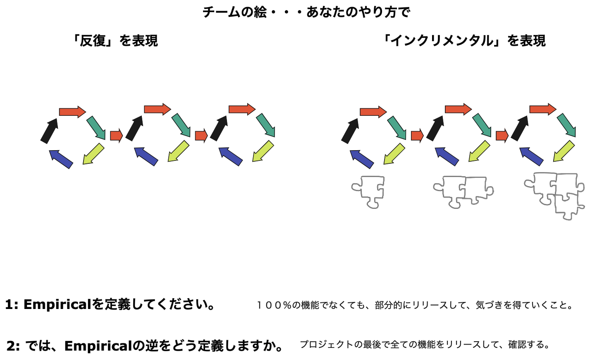</td>
  <td>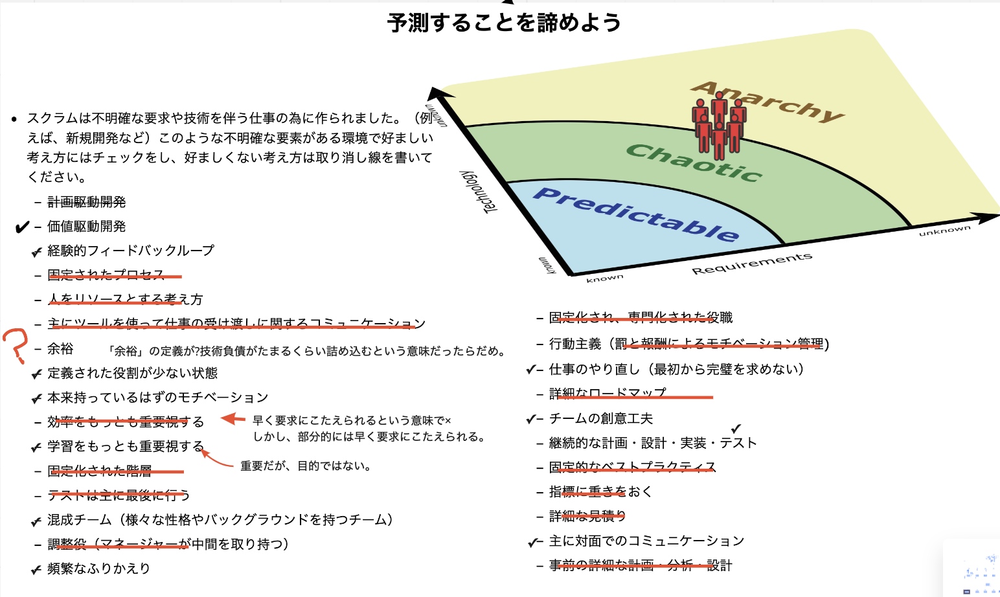</td>
</tr>
</table>
 

## [Day2](#Day2)
- 全てのソフトウェア開発はINVESTに分割可能

<table border="0">
<tr>
  <th bgcolor="#EE0000">INVEST</th>
  <th bgcolor="#EE0000">ユーザーストーリー</th>
</tr>
<tr>
  <td>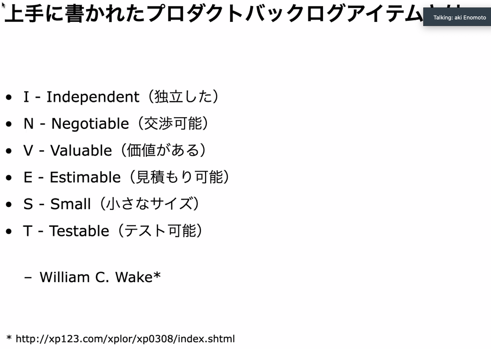</td>
  <td>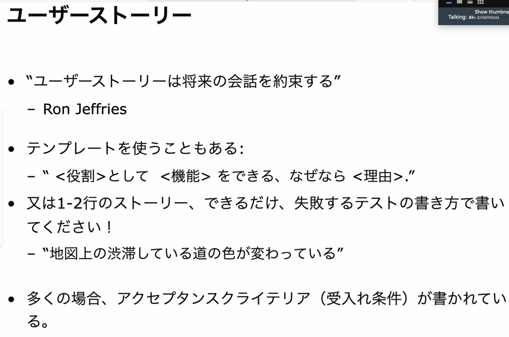</td>
</tr>
<tr>
  <th colspan=2 align=center bgcolor="#EE0000">プロダクトバックログ</th>
</tr>
<tr>
  <td>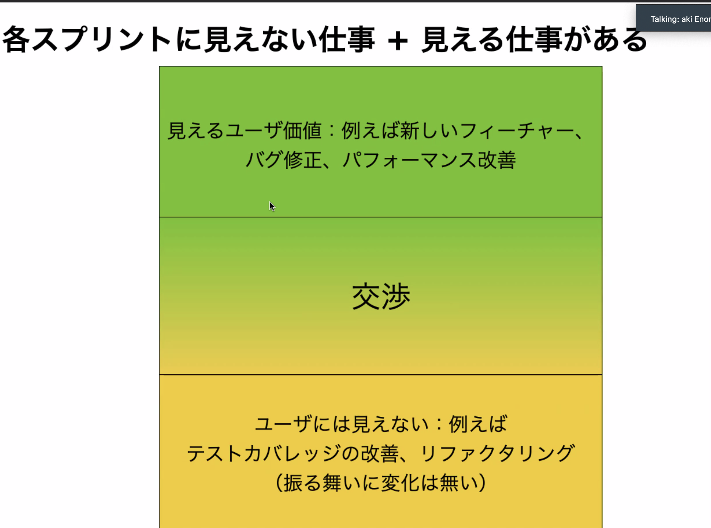</td>
  <td>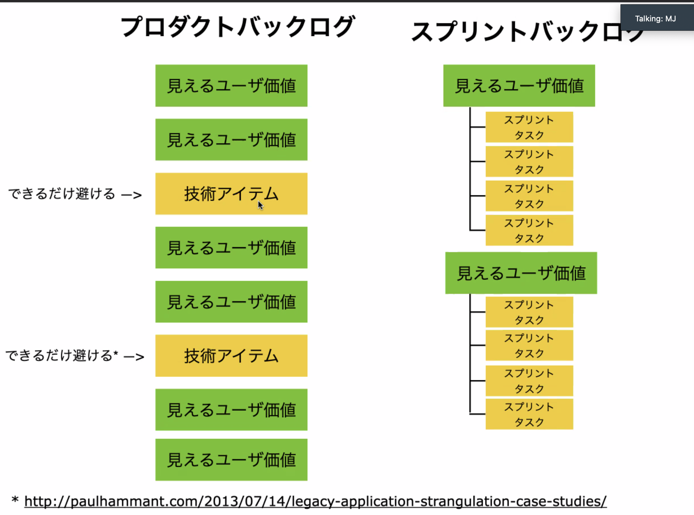</td>
</tr>
</table>
 

## [Day3](#Day3)
- 大規模開発は避けるべき
- 最初は１チーム。徐々にスケールしていく

<table border="0">
<tr>
  <th bgcolor="#EE0000">large scale</th>
</tr>
<tr>
  <td>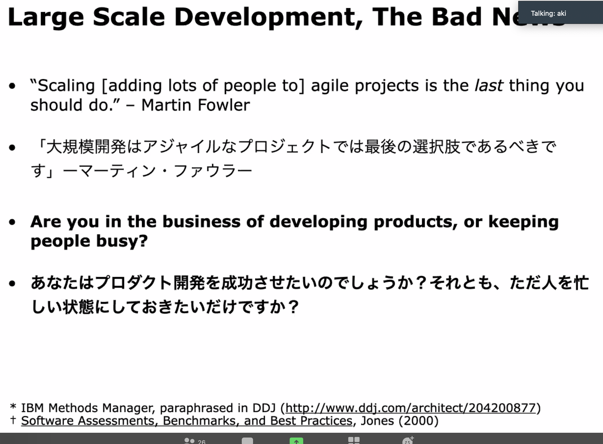</td>
</tr>
</table>
 

## [Day4](#Day4)
- テスト駆動開発（TDD）
  - Test
  - Code
  - Refactoring
- バックログリファインメント
  - POのPBIをチームで分割
  - 分割後のPBIを統合・優先順位付け
  - PBIの依存関係が明確になり混乱することがある
- スプリントプランニング
  - PBIをチーム持っていき、タスクに分割
  - ただしタスクはスクラムフレームワーク外
 

## [Day5](#Day5)
- LESS導入により自己管理型組織になる
  - マネジャーが減る
  - マネジャーはより現場に入っていく
  - デメリット：ミドルマネジメントの負担が増える

<table border="0">
<tr>
  <th colspan=2 align=center bgcolor="#EE0000">組織の変革</th>
</tr>
<tr>
  <td>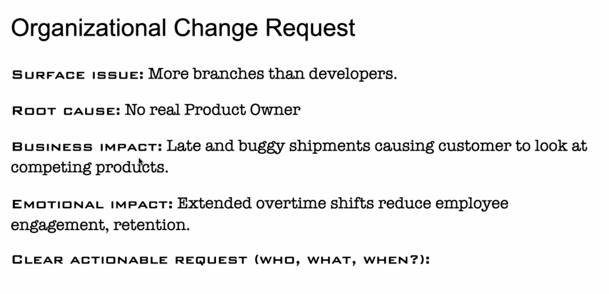</td>
  <td>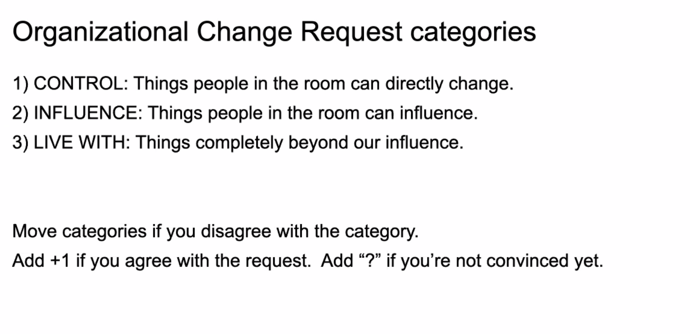</td>
</tr>
</table>
 
<table border="0">
<tr>
  <th bgcolor="#EE0000">マネジャーの役割</th>
  <th bgcolor="#EE0000">スクラムマスターの役割</th>
</tr>
<tr>
  <td>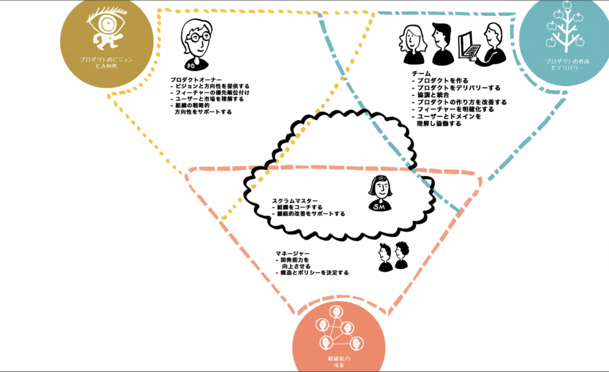</td>
  <td>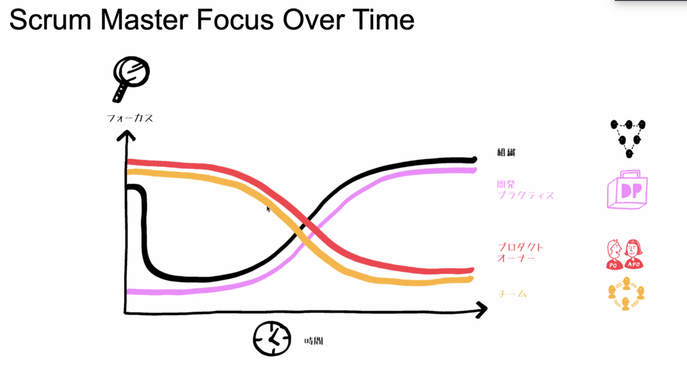</td>
</tr>
</table>
 
